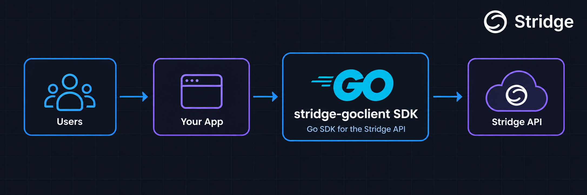
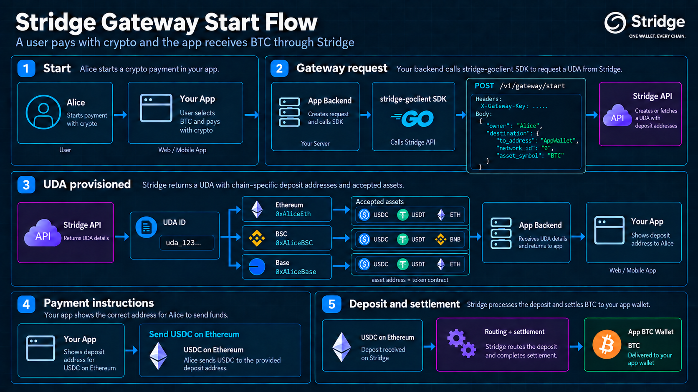

# stridge-goclient

[](https://github.com/arshamhaq/stridge-goclient/actions/workflows/ci.yml)
[](go.mod)

`stridge-goclient` is a small Go SDK for the [Stridge](https://docs.stridge.com) HTTP/JSON API. It gives application code typed methods for quotes, supported assets, Universal Deposit Addresses (UDAs), and gateway flows without repeating request construction and response decoding at every call site.

This repository is an **educational backend engineering project**. It is intentionally small, sandbox-first, and not yet a production-complete SDK.

## Status

Implemented:

- client configuration, URL validation, and HTTP timeouts
- shared JSON request and API error handling
- cross-chain quotes
- supported assets
- direct UDA creation
- gateway start
- local mock-server tests for implemented endpoints

Not implemented yet:

- gateway polling
- retry or exponential-backoff policies
- settlement waiting helpers

The default API environment is the Stridge sandbox:

```text
https://api.stridge.dev/v1
```

## API

| Function | HTTP operation | Authentication | Purpose |
| --- | --- | --- | --- |
| `NewClient(Config)` | — | — | Validates configuration and constructs a reusable client. |
| `Quote(ctx, req)` | `GET /v1/uda/quote` | Public | Returns an indicative route, output amount, fees, and expiry. |
| `SupportedAssets(ctx)` | `GET /v1/uda/supported-assets` | Public | Lists supported networks, native currencies, and token assets. |
| `CreateUDA(ctx, req)` | `POST /v1/uda` | `X-API-Key` | Creates or returns the UDA associated with an owner. |
| `GatewayStart(ctx, req)` | `POST /v1/gateway/start` | `X-Gateway-Key` | Provisions or fetches gateway deposit addresses for an owner and destination. |
| `GatewayPoll(ctx, owner)` | Planned | `X-Gateway-Key` | Will retrieve gateway and settlement state; currently returns `ErrNotImplemented`. |

All endpoint methods accept `context.Context`, so callers control cancellation and deadlines.

## Installation

```bash
go get github.com/arshamhaq/stridge-goclient
```

Import the module using the package name `stridge`:

```go
import stridge "github.com/arshamhaq/stridge-goclient"
```

## Configuration

```go
client, err := stridge.NewClient(stridge.Config{
	BaseURL:    stridge.SandboxBaseURL,
	APIKey:     os.Getenv("STRIDGE_API_KEY"),
	GatewayKey: os.Getenv("STRIDGE_GATEWAY_KEY"),
})
if err != nil {
	log.Fatal(err)
}
```

| Field | Behavior |
| --- | --- |
| `BaseURL` | Defaults to `SandboxBaseURL`. `ProductionBaseURL` is available for future use. |
| `APIKey` | Sent only by endpoints that require `X-API-Key`, such as `CreateUDA`. |
| `GatewayKey` | Sent only by gateway endpoints that require `X-Gateway-Key`. |
| `HTTPClient` | Optional. A client with a 30-second timeout is created when omitted. A supplied client is used without mutation. |

The library does not read environment variables or log credentials. Applications own configuration and secret loading.

## Usage

### Quote

`Quote` converts the request model into URL query parameters and decodes the successful JSON response into typed quote models. Token amounts are strings to avoid floating-point precision loss.

```go
ctx, cancel := context.WithTimeout(context.Background(), 10*time.Second)
defer cancel()

quote, err := client.Quote(ctx, stridge.QuoteRequest{
	FromNetworkID: 1,
	FromAsset:     "0x0000000000000000000000000000000000000000",
	ToNetworkID:   56,
	ToAsset:       "0x55d398326f99059fF775485246999027B3197955",
	Amount:        "1000000000000000000",
})
if err != nil {
	log.Fatal(err)
}

fmt.Println(quote.Data.To.Amount)
```

### Supported assets

`SupportedAssets` retrieves the network and token catalogue used to build asset selectors and valid endpoint requests.

```go
assets, err := client.SupportedAssets(ctx)
if err != nil {
	log.Fatal(err)
}

for _, network := range assets.Assets {
	fmt.Println(network.NetworkName, network.Assets)
}
```

### Create a UDA

`CreateUDA` is the server-side UDA API. It uses the private API key and sends a default settlement destination, optional accepted-asset filters, and optional source-specific routing rules. Repeating the request for the same owner returns the existing UDA.

```go
uda, err := client.CreateUDA(ctx, stridge.CreateUDARequest{
	Owner: "user_123",
	Destination: stridge.CreateUDADestination{
		Address:     "0xDestinationWallet",
		NetworkID:   "9001",
		AssetSymbol: "USDC",
	},
	AcceptedAssets: []string{"USDC", "USDT"},
})
if err != nil {
	log.Fatal(err)
}

fmt.Println(uda.ID, uda.DepositAddresses)
```

### Start a gateway flow

`GatewayStart` uses the gateway key and returns a response envelope containing the owner's UDA, destination, and chain-specific deposit addresses. The operation is idempotent for the same owner and destination.

```go
gateway, err := client.GatewayStart(ctx, stridge.GatewayStartRequest{
	Owner: "0xAliceWallet",
	Destination: stridge.GatewayStartDestination{
		ToAddress:   "bc1qApplicationWallet",
		NetworkID:   "0",
		AssetSymbol: "BTC",
	},
	Metadata: map[string]any{
		"checkout_id": "order_123",
	},
})
if err != nil {
	log.Fatal(err)
}

fmt.Println(gateway.Data.DepositAddresses)
```

The application selects one returned deposit address based on the user's source network and accepted asset. Stridge observes the deposit and settles the configured destination asset.



The diagram is illustrative: deposit addresses receive user funds, while `accepted_assets[].address` identifies a token contract and is not itself a deposit address.

## Errors

Non-2xx responses are returned as `*stridge.APIError`. `StatusCode` comes from HTTP; `Code` and `Message` come from Stridge's JSON error body when present.

```go
var apiErr *stridge.APIError
if errors.As(err, &apiErr) {
	fmt.Printf("HTTP %d, API code %d: %s\n", apiErr.StatusCode, apiErr.Code, apiErr.Message)
}
```

Transport failures and context cancellation remain wrapped, so callers can use `errors.Is` with errors such as `context.Canceled` and `context.DeadlineExceeded`.

## Architecture

The SDK is one Go package at the repository root. This is conventional for a small reusable Go library: consumers import one package, while endpoint files remain separated by domain.

```text
.
├── client.go              client construction
├── config.go              environments, validation, and defaults
├── request.go             shared HTTP/JSON execution
├── errors.go              API error representation
├── models.go              request and response models
├── quote.go               Quote
├── assets.go              SupportedAssets
├── uda.go                 CreateUDA
├── gateway.go             GatewayStart and the GatewayPoll stub
├── *_test.go              tests beside their implementation
├── cmd/example/main.go    sandbox example program
└── .github/workflows      continuous integration
```

There are no controllers, service layers, frameworks, or third-party runtime dependencies.

## Development

The tests use `httptest` servers and do not call the sandbox or production API.

```bash
make fmt       # format Go source
make vet       # run static analysis
make test      # run all tests
make check     # formatting check + vet + tests
```

Run the example with:

```bash
go run ./cmd/example
```

The current example sends a sandbox quote request. Sandbox availability and route support are controlled by Stridge.

## Roadmap

- [x] Client and configuration scaffold
- [x] Quote endpoint
- [x] Supported assets
- [x] Create UDA
- [x] Gateway start
- [x] Basic API error handling
- [x] Mock-server tests for implemented endpoints
- [ ] Gateway polling
- [ ] Retry and exponential backoff
- [ ] `WaitForTerminal` using context and a ticker

## References

- [Stridge API reference](https://docs.stridge.com/reference)
- [Gateway HTTP API](https://docs.stridge.com/gateway/http)
- [Universal Deposit Addresses](https://docs.stridge.com/uda)
- [Supported networks](https://docs.stridge.com/networks)

Stridge and its logo are trademarks of their respective owner.
